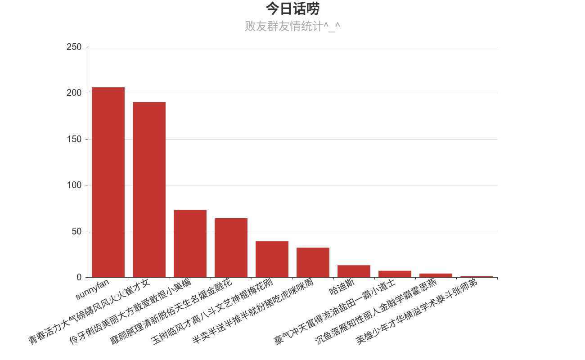
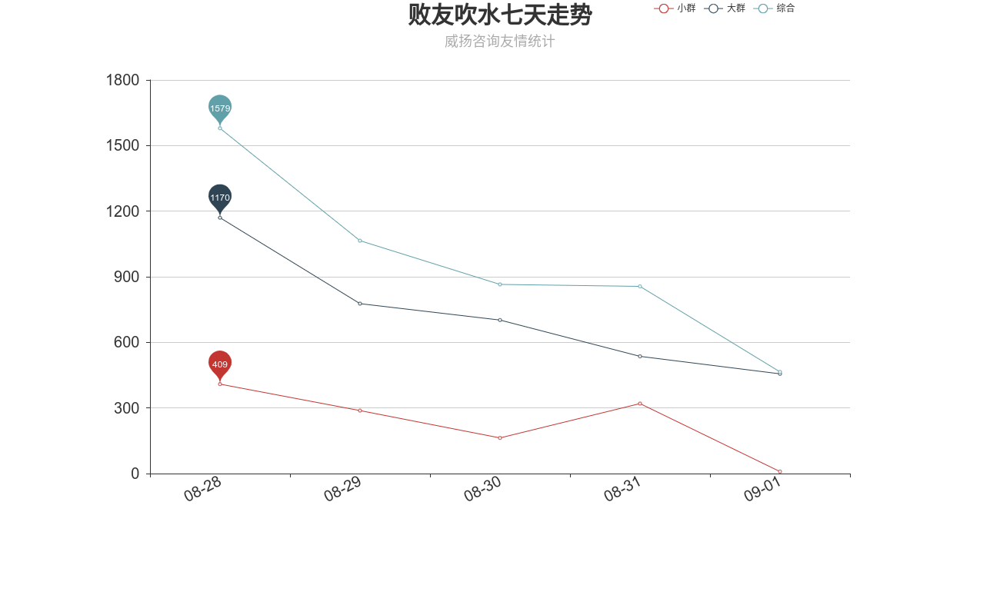

# wechat_robot




**open a shell, and then run this command:**
```
pip3 install pillow
pip3 install itchat
pip3 install pyechats
pip3 install jieba
python3 wechat_monitor.py
```

### then, use wechat scan the qrcode and enjoy it.

+ contents bellow was forked by saga618:
  1. **for pull requests test in github**
  2. *have fun^_^*

### TODO List 星期日, 26. 八月 2018 11:01上午 

  * 1. logging messages detail per hour in text file or into database  
  * 2. count earliest and latest msg's timestamp and it's owner  
  * 3. count top10 per week  
  * 4. count the time of most msg per day and per week  
  * 5. count top10 per month  
 
### Trend Analyse per week

